<div align="center">




</div>

<br/>


## `> whoami`

```txt
full-stack tinkerer · night-owl · deep-work mode
TypeScript · Python · Next.js · automation
DX · sharp UI · ship thin slices
cà phê sữa đá · lofi · green terminals

if it quacks → ship it
if it breaks → fix it
```

Building web UIs, small APIs, and tools that remove friction.


## `> currently hatching`

| project | stack | live |
|:--------|:------|:-----|
| [**ProfileWeb**](https://github.com/duckzangryy/ProfileWeb) | TypeScript | [hori.is-a.dev](https://hori.is-a.dev) |
| [**Anisoul**](https://github.com/duckzangryy/Anisoul) | TypeScript | [anisoul.vercel.app](https://anisoul.vercel.app) |
| [**ProxyAPI**](https://github.com/duckzangryy/ProxyAPI) | JavaScript | [vercel](https://proxy-api-gold-seven.vercel.app) |
| [**web-ui-screenshot**](https://github.com/duckzangryy/web-ui-screenshot) | Python | capture UI at scale |
| [**duckzangryy.github.io**](https://duckzangryy.github.io) | HTML | [pages](https://duckzangryy.github.io) |


## `> telemetry`

<div align="center">


<br/>


<br/><br/>


</div>


## `> trophies`

<div align="center">
  
</div>


## `> system.readout`

```diff
+ focus ........ 98%
+ caffeine ..... max
+ bugs ......... 0*  (*as far as you know)
+ mode ......... ship
```

<div align="center">

<sub>made with ☕ + 🦆 · commits may appear at 03:00 · that's a feature</sub>

<br/>


</div>
