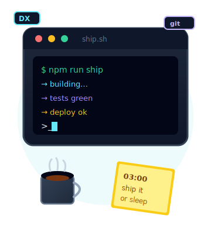

<table width="100%">
  <col width="76%"/>
  <col width="24%"/>
<tr>
<td width="76%" valign="middle" align="center">

<pre align="left">
💼 full-stack tinkerer · night-owl · deep-work
💻 TypeScript · Python · Next.js · automation
📖 DX · sharp UI · ship thin slices
☕ cà phê sữa đá · lofi · green terminals
🦆 if it quacks, ship it · if it breaks, fix it
</pre>

</td>
<td width="24%" valign="middle" align="center">

</td>
</tr>
<tr>
<td colspan="2" align="center" width="100%">

</td>
</tr>
<tr>
<td width="76%" valign="middle" align="center">

<pre align="left">
▸ currently shipping
  tools that remove friction
  DX until the happy path feels boring
  thin slices · ship · observe · fix · repeat

▸ stack
  TypeScript · Python · Next.js · Node · shell · CSS

▸ how I work
  plan thin → build loud → ship quiet → fix loud again
  night-owl · deep work · 03:00 commits are a feature

▸ vibes
  cà phê sữa đá · lofi · green terminals · angry duck stares
</pre>

</td>
<td width="24%" valign="middle" align="center">

</td>
</tr>
</table>

 

<!-- 

  
  &nbsp;&nbsp;
  
  &nbsp;&nbsp;
  
  &nbsp;&nbsp;
  

 -->

made with ☕ + 🦆 · commits may appear at 03:00 · that's a feature

