  

<pre>
    💼 full-stack tinkerer · night-owl · deep-work
    💻 TypeScript · Python · Next.js · automation
    📖 DX · sharp UI · ship thin slices
    ☕ cà phê sữa đá · lofi · green terminals
    🦆 if it quacks, ship it · if it breaks, fix it
</pre>

 

  

made with ☕ + 🦆 · commits may appear at 03:00 · that's a feature

